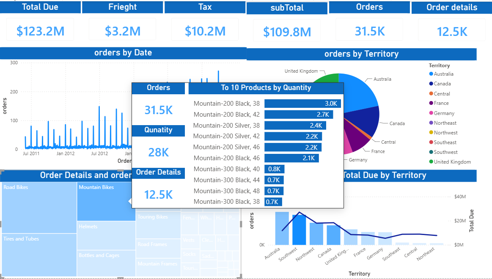
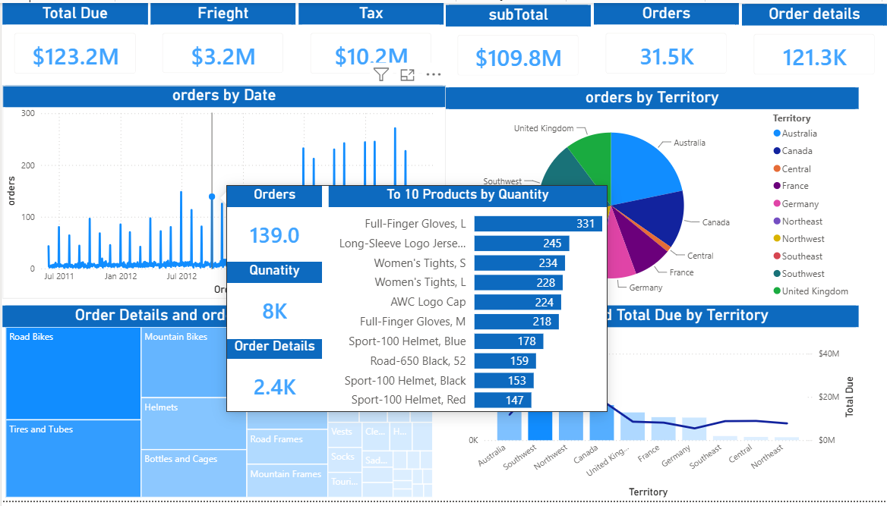
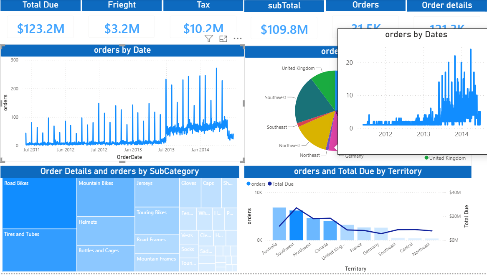

# Sales Analytics Dashboard – Power BI

A multi-page Power BI report built on an AdventureWorks-style sales dataset, covering orders, territories, and order details with interactive cross-filtering.

## 🆕 What's New

- Added a **custom tooltip** on the "Orders by Date" visual that shows Orders, Quantity, and Order Details KPIs together with a Top 10 Products by Quantity breakdown — all in one hover view.
- Tooltip dynamically updates based on the data point being hovered (e.g., hovering a specific date/spike shows the Top 10 products for that period).

*Hovering over a data point on the Orders by Date chart reveals a rich tooltip with KPI cards (Orders, Quantity, Order Details) alongside a ranked list of the top 10 products by quantity for that selection.*

*The tooltip recalculates its Top 10 list per data point — different dates surface different top-selling products, giving quick context without leaving the main report.*

*Tooltip shown in context on the full report canvas.*

## Preview

**Orders page** – detailed order list with date range and territory slicers

**Order Details page (drill-through)** – product-level breakdown per order

## Visuals

- Orders by Date (trend line) **with custom tooltip page**
- Orders by Territory (pie chart)
- Order Details and Orders by SubCategory (treemap)
- Orders and Total Due by Territory (combo chart)

## Pages

- Sales
- Orders
- OrderDetails
- Tooltip *(new — dedicated tooltip page used for the custom tooltip visual)*

## Data Model

Built on a relational sales schema including `Orders`, `OrderDetails`, `Customer`, `Product`, `Store`, `Territory`, and `Date` tables, with DAX measures for Total Due, Freight, Tax, and SubTotal.

## Tools

- Power BI Desktop
- DAX measures
- Report Page Tooltips (custom tooltip page)
