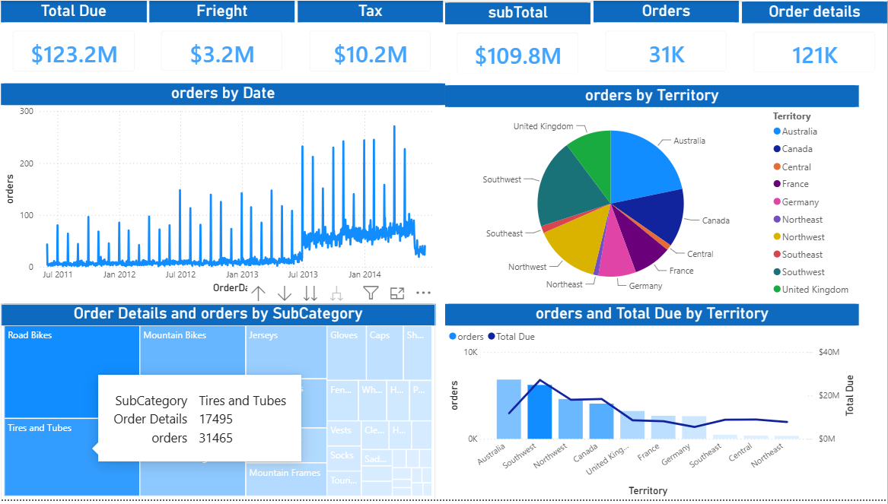
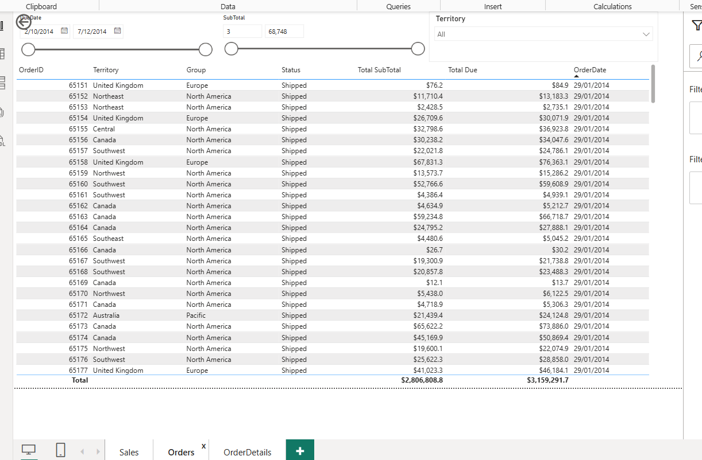
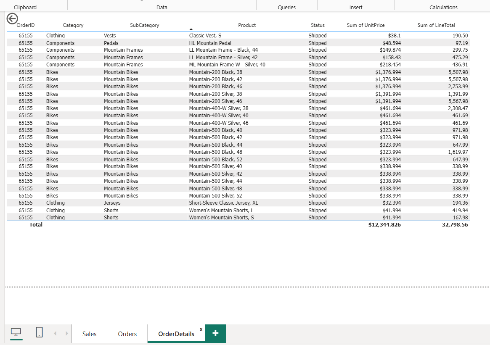

# Sales Analytics Dashboard – Power BI

A multi-page Power BI report built on an AdventureWorks-style sales dataset, covering orders, territories, and order details with interactive cross-filtering.

## Preview

**Orders page** – detailed order list with date range and territory slicers

**Order Details page (drill-through)** – product-level breakdown per order

## Overview

**Key Metrics**
- Total Due: $123.2M
- Freight: $3.2M
- Tax: $10.2M
- SubTotal: $109.8M
- Orders: 31K
- Order Details: 121K

**Visuals**
- Orders by Date (trend line)
- Orders by Territory (pie chart)
- Order Details and Orders by SubCategory (treemap)
- Orders and Total Due by Territory (combo chart)

**Pages**
- Sales
- Orders
- OrderDetails

## Data Model

Built on a relational sales schema including `Orders`, `OrderDetails`, `Customer`, `Product`, `Store`, `Territory`, and `Date` tables, with DAX measures for Total Due, Freight, Tax, and SubTotal.

## Tools

- Power BI Desktop
- DAX measures
- SQL pre-aggregation
